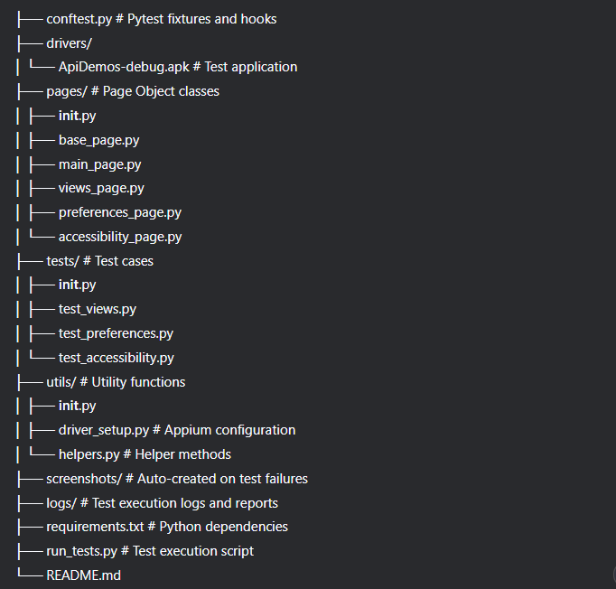

# Mobile Test Automation Project

This project contains automated tests for a mobile application using Appium, Python, and supporting tools. The tests cover various scenarios to ensure that the application's functionality works as expected. Due to issues encountered while running the React Native app with Expo, I have opted to use the Appium ApiDemos application as an alternative demo for this testing.

## Prerequisites

Before running the tests, ensure you have the following installed:

### 1. Environment Setup

#### Required Software:
- **Python 3.8+**: [Download Python](https://www.python.org/downloads/)
- **Node.js**: [Download Node.js](https://nodejs.org/) (Required for Appium)
- **JDK 8 or later**: [Download JDK](https://adoptium.net/)
- **Android Studio**: [Download Android Studio](https://developer.android.com/studio) (For emulator and SDK tools)
- **Appium Server**: Install via npm: `npm install -g appium`
- **Appium Python Client**: Install via pip: `pip install Appium-Python-Client`
- **Appium Doctor**: `npm install -g appium-doctor` (to verify setup)

#### Additional Tools:
- **Appium Inspector**: For element inspection [Download Appium Inspector](https://github.com/appium/appium-inspector)
- **Expo Go App** (if testing Expo apps): Available on Play Store/App Store

### 1.Installation
1. Install Appium:
   ```bash
   npm install -g appium
   npm install -g appium-doctor
   
2. Install Python dependencies: `pip install -r requirements.txt`

### 2. Device Setup

You can use either:
- **Android Emulator**: Create an Android emulator (API 28+ recommended)
- **Physical Device**: Or connect a physical device with USB debugging enabled
- **adb devices**: Verify device appears in `adb devices`

## Project Structure


## How to Run the App Under Test

### With Expo:
1. Install Expo CLI: `npm install -g expo-cli`
2. Start the development server: `expo start`
3. Scan the QR code with Expo Go app on your device

### Without Expo:
1. Build the app for your platform
2. Install the APK on your device/emulator:

## How to Execute the Tests
1. Start Appium server: `appium`
5. Run tests:
- Run with HTML report all tests: `python -m pytest tests/ -v --html=report.html`
- Run with HTML report specific test: `pytest -m tests/test_file.py -v --html=report.html`
- Run with Python Script: `python run_tests.py`

## Screenshots on Failure
- Screenshots are automatically saved in the `screenshots/ `directory when tests fail
- The directory will be created automatically on first failure
- Screenshots are named with timestamp and test name for easy identification

## Configuration
1. Edit `utils/driver_setup.py` to configure:
- Device name
- Platform version
- App path
- Timeouts

## Reporting
- Console output shows immediate results
- HTML report generated with --html flag
- Screenshots saved for failed tests
- Logs available in Appium server output
- Logs and exceptions are available in the report on failure.